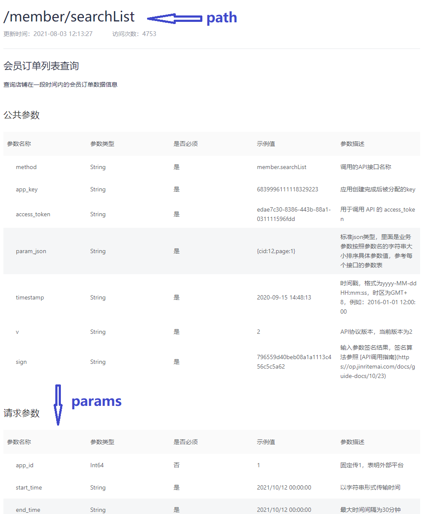

# 抖店 Python SDK

[](https://badge.fury.io/py/doudian)
[](https://img.shields.io/pypi/dw/doudian)

## 介绍

抖店 Python SDK。

欢迎抖店相关开发者扫码进 QQ 群(群号：799137292)讨论：


## 适用对象

**抖店 Python SDK**同时支持自用型应用和工具型应用，具体说明详见[官网](https://op.jinritemai.com/docs/guide-docs/127/17)。

## 特性

1. 自动维护 access_token 的更新；
2. 支持本地缓存 access_token；
3. 业务参数自动排序，无需预处理；
4. 消息推送自动验证，自动解析；
5. 支持沙箱环境[测试店铺](https://op.jinritemai.com/docs/guide-docs/129/209)。

## 源码

[github](https://github.com/minibear2021/doudian)

[gitee](https://gitee.com/minibear2021/doudian)

## 安装

```
$ pip install doudian
```

## 使用方法

### 准备

参考抖店官方文档准备好 app key、app secret、shop id 等，具体见官方开发文档。

### 一个最小的后端

[examples.py](examples.py) 演示了一个带有[会员订单列表查询](https://op.jinritemai.com/docs/api-docs/13/366)接口和[消息推送处理](https://op.jinritemai.com/docs/guide-docs/153/99)接口的后端。
首先，修改 **examplys.py** 里以下几项配置参数：

```python
# App类型，SELF=自用型应用, TOOL=工具型应用
APP_TYPE = AppType.SELF

# 应用key，长度19位数字字符串
APP_KEY = '3409409348479354011'

# 应用密钥 字符串
APP_SECRET = '2ad2355c-01d0-11f8-91dc-05a8cd1054b1'

# 店铺ID，自用型应用必传。
SHOP_ID = '323423'

# token缓存文件
TOKEN_FILE = './323423.token'

# 日志记录器，记录web请求和回调细节
logging.basicConfig(filename=os.path.join(os.getcwd(), 'demo.log'), level=logging.DEBUG, filemode='a', format='%(asctime)s - %(process)s - %(levelname)s: %(message)s')
LOGGER = logging.getLogger("demo")

# 代理设置，None或者{"https": "http://10.10.1.10:1080"}，详细格式参见https://docs.python-requests.org/zh_CN/latest/user/advanced.html
PROXY = None

# 沙箱模式测试店铺
TEST_MODE = False
```

接下来初始化 DouDian 实例并配置一个合适的接口：

```python
# 初始化
doudian = DouDian(
    app_key=APP_KEY,
    app_secret=APP_SECRET,
    app_type=APP_TYPE,
    shop_id=SHOP_ID,
    token_file=TOKEN_FILE,
    logger=LOGGER,
    proxy=PROXY,
    test_mode=TEST_MODE
)

app = Flask(__name__)

@app.route('/brandList')
def brand_list():
    # 以获取店铺的已授权品牌列表为例，参照官方文档，将path和params拼凑好传入request接口，调用成功后即可获取店铺的已授权品牌列表数据。
    # https://op.jinritemai.com/docs/api-docs/13/54
    path = '/shop/brandList'
    params = {}
    result = doudian.request(path=path, params=params)
    return jsonify({'result': result if result else ''})

```

检查一下参数无误，现在就可以用 python 解释器来运行：

```shell
$ python examples.py
 * Serving Flask app "examples" (lazy loading)
 * Environment: production
   WARNING: This is a development server. Do not use it in a production deployment.
   Use a production WSGI server instead.
 * Debug mode: off
 * Running on http://127.0.0.1:5000/ (Press CTRL+C to quit)
```

现在访问 http://127.0.0.1:5000/orderList ，如果一切正常，你会看到类似下面一串 json 字符串：

```python
{
    "result":
    {
        "code":10000,
        "data":[],
        "err_no":0,
        "log_id":"20211203091350010194059098259B567F",
        "message":"success",
        "msg":"success",
        "sub_code":"",
        "sub_msg":""
    }
}
```

到这一步一个最小化的后端就完成了。

**以上步骤如果不能正确执行，务必仔细检查各项初始化参数，必要的情况下，登录抖店后台，将所有参数重置。**

下面配置一个消息推送接口，以便接收处理抖店提供的[消息推送服务](https://op.jinritemai.com/docs/guide-docs/153/99)。

```python
@app.route('/notify', methods=['POST'])
def notify():
    result = doudian.callback(request.headers, request.data)
    if result:
        tag = result.get('tag')
        if tag == '0':  # 抖店推送服务验证消息，需立即返回success
            return jsonify({'code': 0, 'msg': 'success'})
        if tag == '100':  # 订单创建消息，更多消息类型查阅官方文档。
            # TODO: 根据推送的消息参数进行必要的业务处理，5秒内返回success
            return jsonify({'code': 0, 'msg': 'success'})
        return jsonify({'code': 0, 'msg': 'success'})
    else:
        return jsonify({'code': 40041, 'message': '解析推送数据失败'})
```

消息推送接口上线后，将 url 地址配置到抖店后台，抖店服务器将自动推送一条 tag 值为'0'的验证消息，验证通过后方能启用消息推送服务。

## 通用接口

### request(path: str, params: dict)

所有抖店的 API 调用都通过**doudian.request()**接口进行。此接口需要传入 path 和 params 两个参数。
参数值参照官方文档组织，形式类似下面的代码，其中 params 只需要传入请求参数或业务参数，公共参数无需传入，SDK 内部会自行处理：


```python
path = '/member/searchList'
params = {}
params.update({'app_id':1})
params.update({'start_time': '2021/10/12 00:00:00'})
params.update({'end_time': '2021/10/12 00:00:00'})
params.update({'page':1})
params.update({'size':50})
result = doudian.request(path=path, params=params)
```

### init_token(code: str)

用于初始化或重置 access token，通常情况下无需手工调用，仅当以下场景时才需要：

1. 工具型（AppType.TOOL）应用初始化 DouDian 的时候未传入 code，可在获取到 code 时调用；
2. 工具型（AppType.TOOL）或自用型（AppType.SELF）应用需要强制重置 access token 时调用;
3. 捕获到 TokenError 异常时调用。

### callback(headers: dict, body: bytes)

抖店消息推送解析验证接口，将收到的推送 headers 和 body 原样传入，接口内自动解析并验证。

```python
result = doudian.callback(request.headers, request.data)
```

### build_auth_url(service_id: str, state: str)

工具型应用授权 url 构造接口，生成的授权 url 发送给商户完成授权验证以获取 code。获取到的 code 可以调用 init_token(code)接口进行 access token 的初始化或重置。

```python
service_id = 'demo service id'
state = 'demo state'
result = doudian.build_auth_url(service_id=service_id, state=state)
```

以上接口的调用示例可以参考[examples.py](examples.py)。

### 接口函数参数

参数类型对照参考下表：

| 抖店 API 官方文档声明 | **doudian python sdk** |
| --------------------- | ---------------------- |
| String                | str                    |
| Int64, Number         | int                    |
| object, Json, Struct  | dict: {}               |
| List, JsonArray       | list: []               |
| Bool                  | bool: True, False      |

### 接口函数返回值

每个接口均返回 None 或 json。

## 常见问题

### 消息推送解析失败处理

开发者遇到的难点之一就是消息推送解析失败的问题，由于众多的 python web 框架对回调消息的处理不完全一致，如果出现回调验证失败，请务必确认传入的 headers 和 body 的值和类型。
通常框架传过来的 headers 类型是 dict，而 body 类型是 bytes。使用以下方法可直接获取到解密后的实际内容。

#### flask 框架

直接传入 request.headers 和 request.data 即可。

```python
result = doudian.callback(headers=request.headers, body=request.data)
```

#### django 框架

由于 django 框架特殊性，会将 headers 做一定的预处理，可以参考以下方式调用。

```python
headers = {}
headers.update({'app-id': request.META.get('HTTP_APP_ID')})
headers.update({'event-sign': request.META.get('HTTP_EVENT_SIGN')})
result = doudian.callback(headers=headers, body=request.body)
```

#### tornado 框架

直接传入 request.headers 和 request.body 即可。

```python
result = doudian.callback(headers=request.headers, body=request.body)
```

#### 其他框架

参考以上处理方法，大原则就是保证传给 callback 的参数值和收到的值一致，不要转换为 dict，也不要转换为 string。
